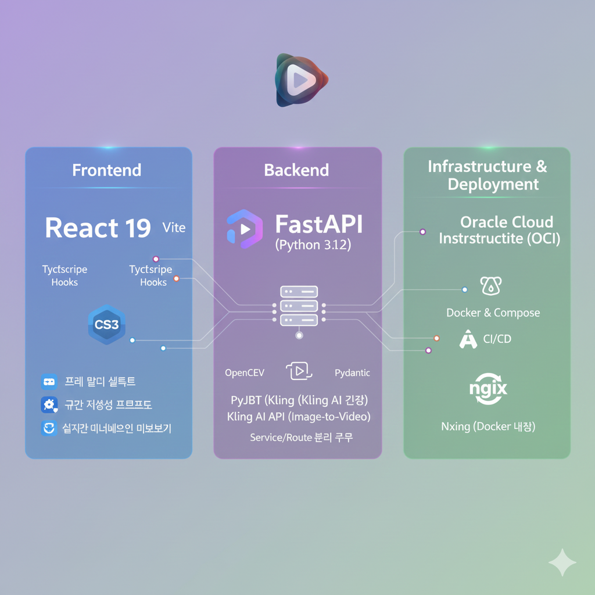
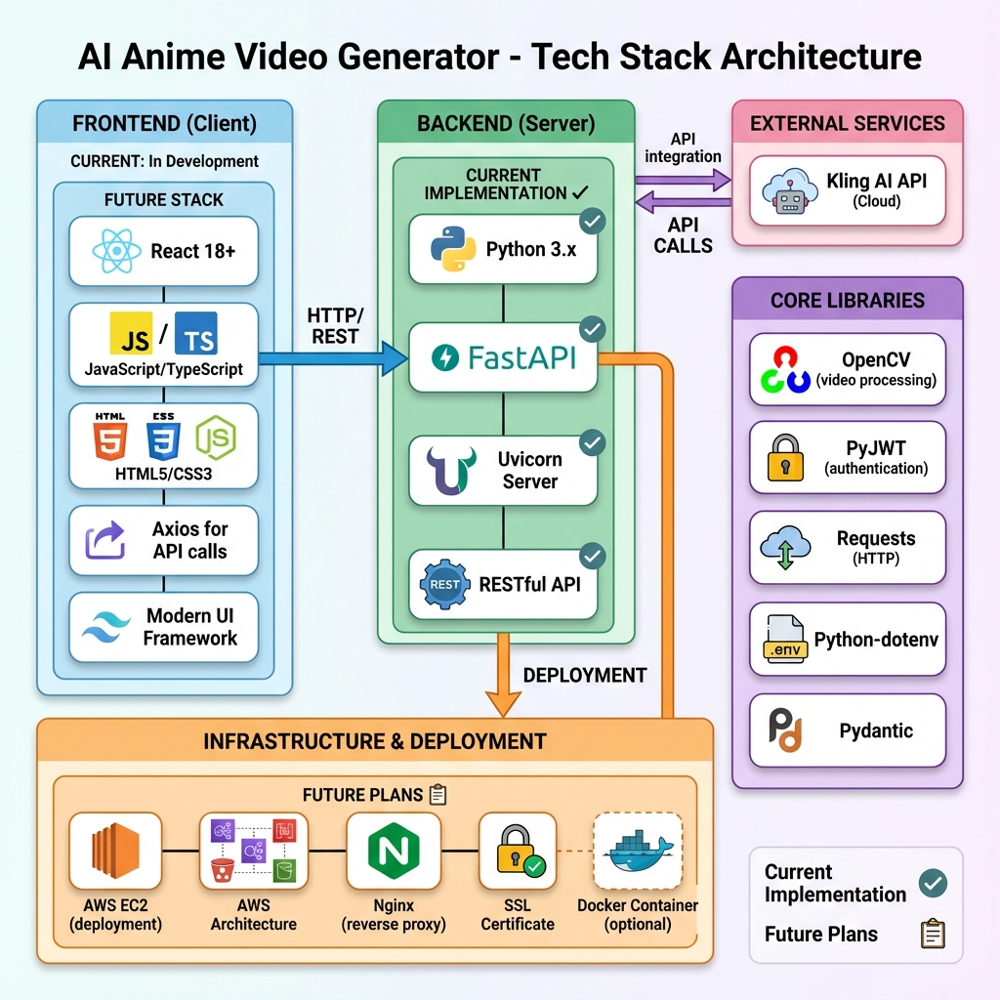

# AI Anime Video Generator

Kling AI를 활용한 AI 애니메이션 비디오 생성 시스템

## 📋 프로젝트 개요

최근 방영된 **'원펀맨' 3기 애니메이션 제작 과정에서 겪었던 퀄리티 저하 논란**은 애니메이션 업계가 직면한 고질적인 문제를 시사합니다. 뛰어난 작화가 필요한 핵심 액션 구간에서 **높은 인건비와 촉박한 제작 일정**으로 인해 비용 효율적인 대안이 절실합니다.

본 프로젝트는 이러한 문제를 해결하기 위해 **AI 기술을 활용하여 고품질의 애니메이션 중간 프레임을 자동으로 생성**하는 것을 목표로 합니다.

- **배경 문제:** 고퀄리티 애니메이션, 특히 액션 장면의 **'동화(In-between Frames)'**를 수작업으로 제작하는 데 드는 막대한 **시간과 비용을 절감**하고 제작 일정을 단축해야 합니다.
- **솔루션:** **Kling AI의 이미지 기반 비디오 생성(Image-to-Video) 능력**을 활용하여, 핵심 키 프레임(Key Frames) 두 개만 입력하면 그 사이의 부드럽고 자연스러운 애니메이션(동화) 프레임을 **AI가 자동으로 생성**하여 제작 비용과 시간을 혁신적으로 줄입니다.

궁극적으로 이 시스템은 기존 애니메이터의 노동 집약적인 작업을 보조하고, 창의적인 키 프레임 작업에 집중할 수 있도록 지원하는 **'애니메이션 제작 보조 도구(Assistant Tool)'** 역할을 수행합니다.

## 🛠️ 기술 스택

### 현재 구현



### 예상 기술 스택 (미래 계획 포함)



### Backend

- **언어**: Python 3.x
- **웹 프레임워크**: FastAPI
- **ASGI 서버**: Uvicorn

### Core Libraries

- **opencv-python (cv2)**: 비디오 프레임 추출 및 처리
- **PyJWT**: JWT 토큰 생성 (Kling AI 인증)
- **requests**: HTTP API 통신
- **python-dotenv**: 환경 변수 관리
- **pydantic**: 데이터 검증 및 설정 관리

### External API

- **Kling AI API**: 이미지 기반 비디오 생성 (Image-to-Video)

### Development Tools

- **Git**: 버전 관리
- **venv**: Python 가상환경

---

## 🔮 미래 계획

### Frontend (예정)

- **프레임워크**: React 18+
- **언어**: JavaScript/TypeScript
- **HTTP Client**: Axios
- **UI 라이브러리**: 검토 중 (Material-UI, Tailwind CSS 등)

### Infrastructure & Deployment (예정)

- **클라우드**: AWS EC2
- **웹 서버**: Nginx (리버스 프록시)
- **보안**: SSL/TLS 인증서
- **컨테이너화**: Docker (선택적)

## 📁 프로젝트 구조

```
AI-anime/
├── server/              # 백엔드 서버
│   ├── app/
│   │   ├── animator.py  # Kling AI 통신 및 비디오 생성
│   │   └── main.py      # FastAPI 애플리케이션
│   ├── config/
│   │   ├── settings.py  # 설정 관리
│   │   ├── .env         # 환경 변수 (API 키)
│   │   └── .env.example # 환경 변수 템플릿
│   ├── test_video_generation.py  # GUI 테스트 스크립트
│   ├── requirements.txt # Python 패키지 목록
│   └── .venv/          # 가상환경
├── client/             # 프론트엔드 (예정)
└── README.md
```

## 🚀 시작하기

### 1. 환경 설정

```bash
cd server
python -m venv .venv
.venv\Scripts\activate  # Windows
pip install -r requirements.txt
```

### 2. API 키 설정

`server/config/.env` 파일을 생성하고 Kling AI API 키를 입력하세요:

```env
KLING_ACCESS_KEY=your_access_key
KLING_SECRET_KEY=your_secret_key
```

### 3. 실행

#### GUI 테스트

```bash
python test_video_generation.py
```

#### API 서버

```bash
uvicorn app.main:app --reload
```

## 📡 API 엔드포인트

### `POST /generate-video`

비디오 생성 (시작/끝 이미지 → 애니메이션)

**요청**:

- `start_image`: 시작 프레임 (파일)
- `end_image`: 끝 프레임 (파일)
- `prompt`: 비디오 생성 프롬프트 (텍스트)
- `project_name`: 프로젝트 이름 (텍스트)

**응답**:

```json
{
  "status": "success",
  "message": "비디오 생성 완료",
  "data": {
    "project_name": "my_project",
    "frame_count": 150,
    "frames": ["path/to/frame1.jpg", ...]
  }
}
```

### `POST /regenerate-segment`

특정 구간 재생성 (Revision)

**요청** (JSON):

```json
{
  "project_name": "my_project",
  "start_image_path": "path/to/frame_10.jpg",
  "end_image_path": "path/to/frame_20.jpg",
  "target_frame_count": 11,
  "prompt": "smooth animation"
}
```

### `POST /generate-frame`

단일 프레임 생성 (말풍선 제거 등)

## 🔑 주요 기능

- ✅ 두 이미지 사이의 부드러운 애니메이션 생성
- ✅ 특정 구간 재생성 (Revision)
- ✅ 프레임 추출 및 저장
- ✅ GUI 기반 테스트 인터페이스
- ✅ RESTful API 제공

## 📝 라이선스

이 프로젝트는 개인 프로젝트입니다.
